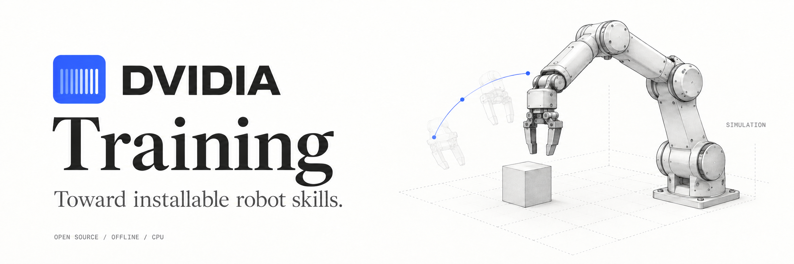

# DVIDIA Training

Train a small visual model from Skillspace footage on your own computer or server. The pipeline checks actual videos and source groups, fixes training/development/test splits, fits weights on a CPU, and exports a result with held-out measurements and integrity hashes.

The base install needs **Python 3.12+, NumPy and FFmpeg**. It needs no GPU, CUDA, account or API key. Training is offline by default; downloading software or public footage is a separate, explicit step.

**Visual learning is not an acquired robot skill.** Human videos do not directly supply robot joint commands or contact forces. An optional movement branch requires compatible, validated action supervision; installation and closed-loop qualification remain separate gates.

## Install and open the studio

Install Python 3.12+ and FFmpeg, including `ffprobe`, first. On macOS, `brew install python@3.12 ffmpeg`; on Debian/Ubuntu with Python 3.12+ available, install `python3-venv` and `ffmpeg`. See [platform instructions](docs/installation.md) for Windows PowerShell, disconnected servers and Docker.

macOS / Linux:

```sh
git clone https://github.com/Dvidia-Inference/dvidia-training.git
cd dvidia-training
python3.12 -m venv .venv
.venv/bin/python -m pip install .
.venv/bin/dvidia-training-studio --directory runs/studio
```

Open [http://127.0.0.1:8270](http://127.0.0.1:8270). Select a local Skillspace folder or upload a ZIP, check its footage and groups, train, then inspect and download the result. Larger folders can be supplied by local path. The studio binds only to the local machine; use SSH port forwarding when it runs on a remote server.

For Windows, use `.venv\Scripts\python.exe` and `.venv\Scripts\dvidia-training-studio.exe`; [complete PowerShell commands](docs/installation.md#windows-powershell) are provided.

## Try the pipeline

Generate an explicitly synthetic example, then train and verify its output:

```sh
.venv/bin/dvidia-train example --clips 10 --output examples/visual-demo
.venv/bin/dvidia-train run examples/visual-demo --output runs/visual-demo
.venv/bin/dvidia-train inspect runs/visual-demo
```

The example consists of moving-disc videos. It checks the software path and does not demonstrate human-video learning or shoe organization. Each run needs a fresh output directory.

For your own footage:

```sh
.venv/bin/dvidia-train prepare /path/to/skillspace --output runs/checked
.venv/bin/dvidia-train run runs/checked/dataset/dataset.json --output runs/trained
```

A folder of videos is accepted, with lineage/completeness warnings. Prefer an explicit [`skillspace.training.json`](docs/skillspace-format.md). A public catalog page containing only a demonstration count cannot supply training footage.

## Hardware

These are **provisional planning targets for the small default visual learner**, not verified minimum specifications or guarantees for arbitrary datasets.

| Resource | Proposed starting point | Recommended |
| --- | --- | --- |
| CPU | 1 modern CPU core | 2–4 cores |
| RAM | 2 GiB | 4–8 GiB |
| GPU / VRAM | None required | None required for this learner |
| Free scratch disk | 1 GiB for a small example, plus original footage and installed tools | At least 2 GiB, scaled to your dataset |

Allow space for roughly two additional source copies when checking and then training, plus intermediates and exports. Intake is bounded to 500 MiB per source and 128 MiB per video. At the intake ceiling, the extra copies alone can approach 1 GiB; the starter scratch allowance does not cover those copies plus all intermediates. The studio ZIP upload limit is 24 MiB. [Hardware details and checks](docs/hardware.md) explain the estimates.

Development was tested on a macOS Apple M5 machine with 24 GiB RAM. That machine is not the minimum. [All eight checks passed on runtime commit `d1f0cbc`](https://github.com/Dvidia-Inference/dvidia-training/actions/runs/37740260434): visual training and studio tests on Linux/macOS/Windows with Python 3.12 and 3.13, the optional Linux arm pilot, and actual Docker training with networking disabled. Hardware requirements for larger video models or shoe motor policies remain unmeasured. Run `dvidia-training-doctor` to check installed dependencies and local capacity without training.

## What the result means

The default learner fits a training-only PCA representation and a ridge next-frame predictor. Development footage selects regularization; test footage is scored afterward against last-frame and training-mean baselines. Pixel/latent prediction error is a visual diagnostic, not task success, calibrated 3D understanding or robot competence.

`training-result.zip` contains weights, model contracts, measurements, a trimmed dataset receipt and an integrity manifest. Original footage stays in the local prepared dataset and is excluded from the download. Hashes check consistency; they do not authenticate capture history or measured truth.

Related recording/session/shoe-pair IDs and identical video hashes stay in the same connected source group. Group declarations cannot detect every near duplicate. Five-second cuts from one recording are not independent examples, and no video count is a proven sufficiency threshold.

## Optional arm simulation

```sh
.venv/bin/python -m pip install ".[arm]"
```

This adds MuJoCo 3.15.0 for the existing bounded simulation placement adapter, native telemetry examples and `dvidia-skill-capsule`. A movement candidate still needs an explicit compatible task contract and independent closed-loop qualification. It is not a physical robot driver or a learned shoe policy. See [the movement data contract](docs/skillspace-format.md#movement-supervision).

## Public pilot on Hugging Face

[Recorded demo](https://huggingface.co/spaces/Dvidia/dvidia-training) · [Synthetic datasets](https://huggingface.co/datasets/Dvidia/dvidia-training-examples) · [Pilot models and measurements](https://huggingface.co/Dvidia/dvidia-training-pilot)

The demo presents saved candidate and open-jaw control playback from one exact simulation scene. Training runs locally; the dataset and model cards document reproducible inputs, CPU measurements and the limits of this research alpha. [Maintainer publishing tools](publishing/huggingface/README.md) stage only the already-public synthetic release and use a credential from macOS Keychain without printing or caching it.

MIT licensed. Research and measured limitations: [research.dvidia.org](https://research.dvidia.org). Contact: [hello@dvidia.org](mailto:hello@dvidia.org).
