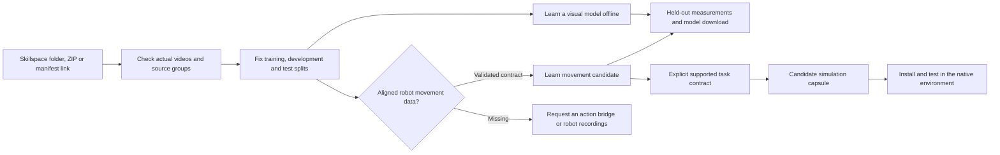

# Train from Skillspace footage

This guide describes the footage pipeline in the standalone dvidia-training package. It runs on a CPU, keeps
local footage local, checks independent source groups, learns model weights,
measures held-out prediction error and exports a data-only result.

The product path is:



## Start the local interface

Install Python 3.12+, the pinned Python packages and FFmpeg (including ffprobe).
FFmpeg is a separate system dependency: on macOS use `brew install ffmpeg`;
on Debian/Ubuntu use `sudo apt-get install ffmpeg`. After installation, training
needs no account or API key. To install on a disconnected server, bring the
matching Python wheels and an FFmpeg package or binary from a connected machine.

```sh
python3.12 -m venv .venv
.venv/bin/python -m pip install .
.venv/bin/python -m dvidia_training.training_studio --directory runs/training-studio
```

Open `http://127.0.0.1:8270`. Select a Skillspace folder or drop its data-only ZIP,
check the footage, then train and download the result. The server binds only to
your own machine. To use it on your server, keep that binding and forward the
port through SSH. Do not expose this local file-reading interface publicly.

The default server prohibits downloads. `--allow-online` enables an explicit
per-job option to fetch a public DVIDIA manifest and its declared media. Training
itself remains local. A catalog URL with a claimed demonstration count but no
actual video paths cannot supply footage.

## One command

```sh
.venv/bin/python -m dvidia_training.footage_pipeline run /path/to/skillspace \
  --output runs/my-first-training
.venv/bin/python -m dvidia_training.footage_pipeline inspect runs/my-first-training
```

After installing this package, the equivalent command is `dvidia-train run`.
Use a fresh output directory for each run; completed results are never silently
overwritten. To check footage without fitting weights, use `dvidia-train prepare`.
A prepared `dataset.json` can be supplied to `run` to reuse the exact split.

Try an explicitly synthetic example before collecting footage:

```sh
dvidia-train example --output examples/visual-skillspace --clips 10
dvidia-train run examples/visual-skillspace --output runs/visual-example
```

These ten encoded six-second videos are schematic moving-disc recordings. They
verify the software path; they supply no evidence about shoe organization.

## Skillspace footage format

A plain folder of videos works, but it cannot establish independent capture
lineage or complete task actions. Prefer `skillspace.training.json` alongside
the videos, with entries like:

```json
{
  "kind": "dvidia.skillspace-training-source",
  "schema_version": 1,
  "task": "Organize shoes into a row",
  "media": [
    {
      "id": "attempt-001",
      "path": "videos/attempt-001.mp4",
      "source_recording_id": "recording-a",
      "session_id": "session-01",
      "shoe_pair_id": "pair-01",
      "complete": true
    }
  ]
}
```

The snippet is one record; a runnable dataset needs at least three independent
connected groups so training, development and test each have data. Clips sharing
a recording, session, physical shoe pair or identical video bytes stay together.
An image-only folder, malformed video, unsafe ZIP, inconsistent hash or leaked
split stops the job. A five-second fragment does not become a complete attempt
because it is short. Begin with ten *complete actions*, then investigate 25, 50
and 100 with independent evaluation; none of these counts is a proven threshold.

Files may be MP4, MOV, WebM, M4V, AVI or MKV. Limits are 128 MiB per video, 500 MiB
per source and 1,200 episodes. Uploads in the interface are limited to 24 MiB;
larger footage folders should be selected by local path. Each file is probed and
hashed from its actual bytes. Declared counts and accuracy are not training evidence.

## What is learned

The first visual learner decodes a fixed number of small RGB frames per clip,
fits a PCA basis on training frames and learns a ridge temporal predictor in that
basis. Development clips choose regularization; test clips are evaluated afterward.
The report includes persistence and training-mean baselines. Error is frame/latent
prediction error, not task success. This inexpensive baseline does not recognize
objects reliably, infer hand forces, reconstruct calibrated 3D action or control
an arm. It establishes a measurable intake-to-weights path for larger learners.

All preprocessing that learns numerical parameters uses training data. Adjacent
frames are not randomly scattered across splits. Separate sessions can still
share near-duplicate content; declared groups and exact hashes cannot discover
every semantic duplicate or authenticate capture history.

`training-result.zip` contains the visual weights, model contract, held-out
measurements, a trimmed dataset receipt and an integrity manifest. Original
footage stays in the local prepared dataset and is excluded from this download.
`inspect` checks every exported file and the ZIP against its recorded hashes.

## Movement and installable capsules

An optional `actions_path` on each video points to a plain JSON sidecar with
timestamped robot state, pose error and six joint increments. It must use the
exact feature contract in `dvidia_training.arm_distill.FEATURE_CONTRACT`, bind the video
SHA-256, bind the sample SHA-256, and carry declared alignment-validation evidence.
See the generated native example for the exact schema. Accepted origins are
robot teleoperation, a validated video/action bridge, or native simulation telemetry.
Matching metadata alone cannot establish correct alignment; keep the underlying
evidence and inspect it.

The movement learner fits an actual normalized RBF ridge head on training groups,
selects regularization on development groups and reports held-out joint-increment
error alongside baselines. It exports a simulation-only candidate. It needs at
least 32 training samples and movement supervision in each split.

To exercise this path with native simulator recordings and synchronized schematic
videos:

```sh
.venv/bin/python -m pip install ".[arm]"
dvidia-train example --native-arm --clips 10 --output examples/native-skillspace
dvidia-train run examples/native-skillspace --output runs/native-training \
  --task-source examples/native-skillspace/task.skill.json
dvidia-skill-capsule install runs/native-training/candidate.skill-capsule.json
```

The explicit task source must be compatible with the existing placement adapter.
Installing a candidate does not qualify it. Use the returned installation ID with
`dvidia-skill-capsule qualify ID --output runs/local-qualification`; then inspect
the exact-scene native success and open-jaw control before running it. The capsule
retains authored phases, contact checks, gripper logic and recovery, and relies on
privileged simulator observations. It is not a learned shoe policy or a physical
robot deployment.

The missing bridge to the original vision is now explicit: recover task geometry
and calibrated action supervision from real human footage, create an appropriate
task environment, validate contact and grasp parameters, and test closed-loop
success on independent objects and layouts. Those gates must precede a claim that
an arbitrary arm acquired a skill from videos.
