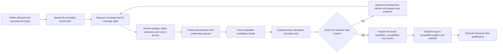

# Execution map: footage to installable skills

Working map, 9 October 2026. This is the team's sequence of builds and evidence
gates. A completed software component does not establish robot competence.

## The product loop

Confirmation evidence is opened after a candidate is frozen. Once inspected,
that suite becomes regression evidence for later changes. Further qualification
needs fresh confirmation scenarios; it cannot silently reuse a known test set.

## Current foundation and next builds

| Order | Build and owner role | Current state | Evidence needed to advance |
| --- | --- | --- | --- |
| 1 | Collection planning — product + data | Local coverage planner, versioned briefs and declared source-group tallies implemented. | First skill's observable goal, operating envelope, actual recordings and reviewed capture lineage. |
| 2 | Contribution review — data + product | Proposed official-site connection; the local planner imports declarations only. | Immutable review receipts tied to original bytes, plan revision, intended-use permission and complete outcomes; source-group and near-duplicate audits. |
| 3 | Episode evidence — simulation | Recorder preserves state, requests, applied commands, sensor age and authored phases at control boundaries. | Task-specific episode corpus, retained failure cases and synchronized inspector. Tapes are not consumed by a learner yet. |
| 4 | Task and state models — learning | Existing small visual predictor and bounded movement head; outcome/phase supervisor proposed. | Choose deployable sensor inputs, compare with simple baselines and measure held-out boundary, outcome and false-completion errors. Keep authored labels and privileged state outside deployment inputs. |
| 5 | Task simulation — simulation | Existing rigid-box placement adapter and frozen benchmark; other tasks need environments. | Validated assets/contact behavior, robot/gripper/sensor contract, reset distributions and independently observable task outcomes. |
| 6 | Qualification and sample efficiency — evaluation | Local benchmark runner and frozen sample-count evidence exist. | Learning curves over independent source groups, multiple collection orders, frozen candidates, nominal/stress/control strata, all attempted trials and measured cost. |
| 7 | Installable skill — runtime | Simulation candidate capsule and compatibility checks exist. | Bundle model, task, observation/action contract, adapter, data/protocol hashes, calibration requirements and artifact-bound qualification results. |
| 8 | Physical transfer — robotics | Unqualified. | Hardware timing/calibration checks, measured limits and a separate supervised physical evaluation. Simulation results alone cannot advance this stage. |

The coverage planner and recorder are available from the current source checkout.
They are not included in the frozen v0.1.0 release or the older Hugging Face pilot.
No new task policy is trained by adding these components.

## First incoming skills

Start with one bounded task and one supported robot/gripper rather than declaring
a universal skill. For shoe organization, distinguish pairing, alignment and
placing on a shelf: each needs a goal, observable result and task environment.
Record initial conditions, the complete attempt and its outcome. Five- or
six-second clips are useful when they contain that whole transition. Preserve
longer originals and shared recording/session/object IDs across every cut.

Collection starts with selected high-value conditions: different physical
instances, starting poses, views, clutter, failed grasps and recoveries. Initial
quotas are workload estimates. Use development errors to refine the plan;
version any changed brief and re-review earlier evidence against it. Freeze
confirmation groups before fitting or adjusting the policy.

Human footage can support visual representations and task labels. Joint commands,
forces and calibrated geometry require robot telemetry or a validated action
bridge. Synthetic variations preserve their parent lineage and are reported
separately from independently captured evidence. Shoe tying needs a deformable
task environment; it cannot inherit the rigid-box adapter's qualification.

## What “enough data” means

Report independent groups, conditions and outcomes, not just video count or
seconds. Run nested training subsets while keeping development evidence fixed.
Predeclare the target success, false-completion and critical-error limits with
uncertainty estimates and a cost budget. Freeze the selected candidate before
opening fresh confirmation trials. A plateau below the target calls for a
diagnosis of observations, actions, model or simulator, not a “done” badge.

Collection coverage, usable data, trained candidate, simulation qualification and
physical qualification remain separate states. A collection quota cannot promote
any of the later states.

## Every skill's benchmark contract

At creation, record a success predicate, meaningful failure cases and whether an
environment exists. A missing environment blocks qualification while collection
and environment work continue. The planner's description is the start of the
contract; an executable benchmark additionally needs:

- Task/environment, asset, physics, controller and sensor versions; observation
  and action units, coordinate frames, degrees of freedom and gripper limits.
- Reset distributions, seeds, episode timeout and nominal, stress, recoverable,
  impossible-task and sensor-fault strata where applicable.
- Authored/simple baselines and matched negative controls; a policy hash and
  frozen dataset/protocol hashes before evaluation.
- All attempted episodes, including failures, errors and incompatibilities;
  success, false completion, recovery and critical-error rates with denominators.
- Wall time, step throughput, end-to-end control latency and memory with named
  hardware and measurement boundaries. CPU-only support is measured per task.
- A supported operating envelope and explicit simulation-only or physical scope.

The next engineering milestone is a tape inspector and a small state-based task
outcome model on the existing placement environment. The first real Skillspace
will then test the collection and review loop. See [collection design](skillspace-coverage.md),
[episode evidence](episode-tape.md) and [existing benchmark protocol](benchmarks.md).

## Reaction and stopping evidence

[Reaction framework v0.1](reaction-framework.md) supplies the first reusable
monitor and native linear-actuator/parallel-jaw coupon fixtures. It tests authored
motion/contact/grip/sensor-fault conditions, matched shadow-monitor controls,
sensor age/dropout, and continued physics after a brake request. Reports retain
all attempts, conditional detection rates with uncertainty, invalid denominators,
timing stages, stopping distance, contact/load outcomes and named CPU cost.

This fixture work precedes integration with the six-axis arm. The next gates are
whole-arm geometry, task-specific expected-contact/retention rules, validated
material and actuator behavior, deployable sensing and measured physical stopping
response. Keep the original placement environment and frozen evidence unchanged;
new profiles and benchmark versions identify these additions. A reaction result
supports a task's evidence bundle without replacing task success, numerical
validation or supervised physical qualification.
